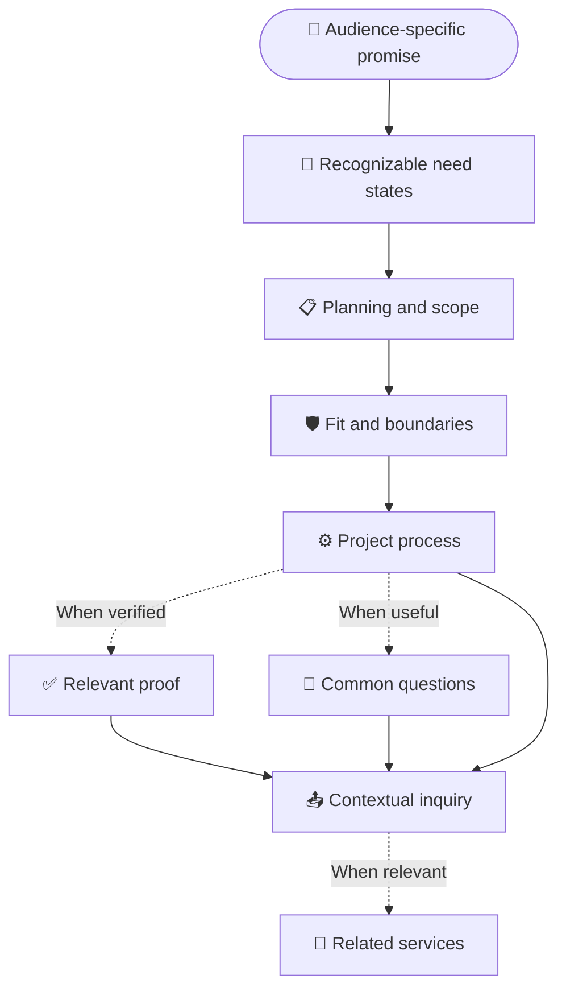
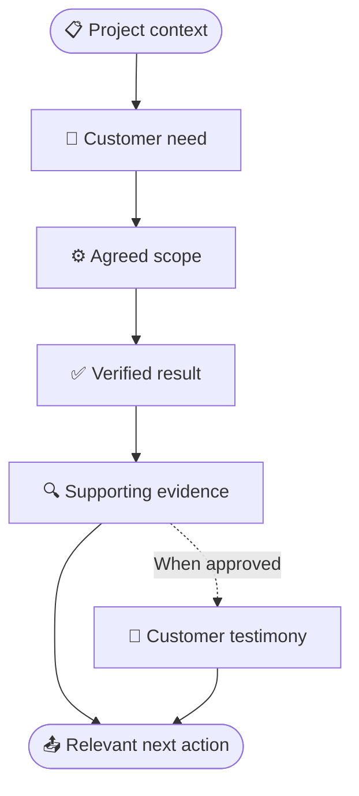

# Reusable service and case-study page templates

_Milestone 03 source of truth for shared service pages and project stories_

---

## 🎯 Template principles

These templates define content order, section responsibilities, and omission rules. They do not require every page to contain the same number of sections, repeated items, or media assets.

- Start with the customer need or operational outcome, then explain scope, boundaries, process, and proof.
- Keep residential and business pages distinct in language, examples, imagery, proof, metadata, and inquiry context while preserving one Blyx visual and interaction system.
- Omit a conditional section when verified content is unavailable. Do not create filler, generic claims, empty containers, or duplicated copy to preserve a visual pattern.
- Keep claims proportional to verified scope and proof. Generated or commissioned marketing imagery never becomes completed-project evidence.
- Use one primary conversion action per content group. Route service inquiries through the audience-aware `/contact/` form.
- Write the compact reading order in the document source. Use grid placement at wider breakpoints rather than CSS reordering.

Networking, Video surveillance, and access control each use one service route. Within a shared service page, Residential and Business content remains distinct in language, imagery, scope, proof, metadata, and inquiry context. Home automation remains Residential-only until a broader verified scope exists.

## 📚 Service-page model

The service page answers four questions in sequence: Is this for me? What does Blyx plan and deliver? What are the boundaries? What happens next?

### Ordered section model

| Order | Section | Status | Content responsibility | Visual and interaction rule |
| ---: | --- | --- | --- | --- |
| 1 | Audience context and hero | Required | Identify the active audience and service; state one outcome-led promise; provide a concise lede and precise inquiry action | Use the standard split hero when approved media adds meaning. Keep copy before media in the source. |
| 2 | Situations or need states | Required | Present two to four recognizable problems, changes, or desired outcomes without prescribing equipment too early | Use a structured list or shared rows. Do not default to a card grid. |
| 3 | Planning and scope | Required | Explain what Blyx evaluates, coordinates, installs, configures, tests, and hands off | Pair concise copy with supporting media only when the media clarifies placement, workmanship, or system relationships. |
| 4 | Fit and boundaries | Required | State good-fit work, compatibility dependencies, exclusions, and claims that require qualification | Keep the boundary visible in ordinary reading flow. Do not bury exclusions in the FAQ. |
| 5 | Project process | Required | Describe discovery, agreement, installation, testing, and handoff in three or four observable steps | Use one numbered sequence with shared rules rather than separate process cards. |
| 6 | Service proof | Conditional | Show verified work relevant to the active audience and service; identify the project honestly | Use authentic project media and a short story. Omit the section when relevant proof does not exist. |
| 7 | Common questions | Conditional by template; required where the content inventory names questions | Resolve recurring qualification, compatibility, operation, or boundary questions not answered clearly above | Include three to six genuine questions. Use semantic headings or disclosure controls with complete keyboard and expanded-state behavior. |
| 8 | Contextual inquiry | Required | Ask for the minimum information needed to begin and carry audience, service, and source context into `/contact/` | Use one primary action with a specific label. Service-area guidance may be a quiet supporting link. |
| 9 | Related services | Conditional | Offer one to three services that are valid for the same audience and meaningfully adjacent to the current need | Use descriptive links after the inquiry action. Omit when no relevant same-audience destination exists. |

### Hero requirements

The hero includes:

- a breadcrumb or equally clear audience context;
- one semantic `h1` naming the customer outcome rather than the equipment category alone;
- a lede that defines the service and active audience in plain language;
- one inquiry action whose label identifies the audience or service; and
- optional media that reinforces the promise without delaying or replacing the copy.

Do not put a full feature list, FAQ, testimonial, multiple competing actions, or audience switch inside the hero. The global or local audience navigation owns switching context.

### Situations and planning

Need states describe circumstances a visitor can recognize. Each item contains one short heading and one concise explanation. Two strong items are sufficient; do not expand to four solely to fill a layout.

Planning and scope explain the decisions that make the finished system dependable. Group related evaluation points into readable themes instead of presenting a product inventory. Access control encompasses compatible automated entry; introduce the relevant distinction within the service page before describing their shared planning work.

### Fit and boundaries

Every service page states:

- the work Blyx is prepared to scope;
- compatibility or site conditions that must be evaluated;
- the most important exclusions or non-guarantees; and
- the expected handoff or customer responsibility.

Boundaries use direct language. They are not warnings, legal fine print, or sales objections. A question may elaborate on a boundary in the FAQ, but the core boundary remains visible in this section.

### Proof rules

Include service proof only when all of the following are true:

1. The work is verified and Blyx has permission to use the asset.
2. The project matches the active audience.
3. The proof supports the service claim beside it.
4. Privacy-safe copy can explain what the viewer is seeing without exposing an address, camera view, coverage detail, or private customer information.

Label authentic work as a completed residential or business project when the surrounding context does not already make that status explicit. A service-specific excerpt may emphasize one part of an integrated project, but it still identifies the source as the same project. Do not split one customer engagement into multiple portfolio entries.

When proof is unavailable, the page moves directly from process to common questions or inquiry. Do not substitute a generated render, stock environment, unverified testimonial, or unrelated audience project.

### FAQ rules

Use an FAQ when at least three recurring questions materially improve qualification or set expectations. Include questions about compatibility, dependencies, operation, project boundaries, or handoff. Avoid questions that repeat section headings or exist only to add search phrases.

Networking, Video surveillance, and residential automated entry include the verified questions recorded in the [content inventory](./content-inventory.md). A future service page may omit the FAQ when its essential questions are already answered in the main flow and fewer than three distinct questions remain.

### Related-service rules

Related services remain within the active audience. Each link states why the adjacent service matters; it does not use a generic `Learn more` label.

- Link only to published, scope-approved routes.
- Prefer services with a real planning or operational relationship to the current page.
- Do not link to the page already being viewed.
- Do not use cross-audience links as related services; use the audience switch instead.
- Omit the section when the only available links are weak or repetitive.

### Service-template fit matrix

The model accommodates the verified services without adding unsupported sections or equalizing their content artificially.

| Service | Need-state emphasis | Planning emphasis | Required boundary | Available proof | FAQ emphasis |
| --- | --- | --- | --- | --- | --- |
| Networking | Coverage gaps, wired devices, construction timing, defined upgrades | Floor plan, materials, access points, cable routes, separation, testing, handoff | Blyx distributes connectivity within the property and does not sell or coordinate internet service | Integrated residential project: attic cabling, improved coverage, organized equipment area | Provider boundary, finished-space cabling, wired versus wireless, compatible equipment, separated access |
| Video surveillance | Useful views, dependable recording, practical review, controlled access | Lighting, positions, angles, cabling, storage, retention, permissions, supported detection | Complete new systems; no takeover, repair, or expansion of systems installed by others; no prevention or identification guarantee | Same integrated residential project: new cabling, recording, remote viewing, organized equipment area | Phone viewing, retention, internet dependence, recording modes, existing-system boundary |
| Residential access control | Credentials, permissions, remote visitor access, and compatible automated entry where applicable | Door condition, frame, hinges, lock, power, egress, permissions, controls, and operator requirements when automatic opening applies | Automated-entry feasibility depends on compatible door, hardware, operator, locking, power, and control sequence | Same integrated residential project: fingerprint entry, two powered entrances, wireless exit activation, remote visitor access | Entry methods, permissions, automated-entry applicability, existing-door feasibility, coordinated systems, remote use, interruption behavior |

Business variants use the same section responsibilities with operational need states, business-specific boundaries, and business proof only when verified. They do not inherit residential examples or media.

## 📦 Case-study model

A project story distinguishes what the customer needed, what Blyx agreed to deliver, and what became possible after handoff. It is not a service list or image gallery.

### Story fields

| Field | Status | Required content | Exclude |
| --- | --- | --- | --- |
| Project context | Required | Audience, private or publishable location level, project type, and relevant service set | Street address, unsupported dates, invented project name, or implied portfolio scale |
| Customer need | Required | The practical problem, routine, access need, operational constraint, or desired outcome | Product-first framing or dramatized stakes |
| Agreed scope | Required | The work Blyx planned and delivered, including coordinated systems when relevant | Work outside the verified record or a catalog of every installed part |
| Result | Required | The observable, supportable outcome after testing and handoff | Guaranteed future performance, prevention claims, or invented metrics |
| Evidence | Required | Authentic images, video, captions, or factual installation details that substantiate the story | Generated imagery presented as proof, privacy-sensitive views, or decorative gallery filler |
| Testimonial | Conditional | Approved wording and attribution from the same customer | Placeholder, paraphrased, composite, or invented quotations |
| Next action | Conditional but recommended | One inquiry link tied to the demonstrated need or a relevant service destination | Multiple competing CTAs or an unrelated service pitch |

### Integrated-project rule

The available networking, video-surveillance, and automated-entry material belongs to one private residential project. Present it as one integrated project story with service chapters or evidence groups. Service pages may quote a relevant excerpt, but every excerpt identifies the same project context.

The story may organize evidence under these verified outcomes:

1. A more dependable network foundation with new attic cabling, improved Wi-Fi coverage, and an organized central equipment area.
2. A camera system supported by the same cabling and network foundation, with dependable recording and remote viewing configured without publishing private views or coverage details.
3. Independent entry and exit through two residential doors using powered swing-door operators, fingerprint entry, wireless activation, and remote visitor access.

Do not describe these outcomes as separate projects, separate customers, business proof, or home-automation proof.

### Evidence order

Lead with the minimum media that establishes the result, then use supporting details. A case study may include one primary figure plus a small evidence group; it does not need a gallery for every available asset.

- Keep captions specific to the visible evidence.
- Keep video controls native and provide a descriptive caption or transcript-equivalent explanation.
- Place testimonial copy after the result it supports, not before the need or scope.
- Keep generated concept imagery outside the proof sequence.
- Omit empty media positions instead of repeating or enlarging weak assets.

## 🔗 Calls to action and routing

Service-page actions identify the active context and initialize the canonical contact route. Parameters configure the form and are removed from the visible URL after initialization.

| Location | Label pattern | Destination rule |
| --- | --- | --- |
| Residential service context | `Discuss a home [service] project` | `/contact/?audience=residential&service={service}&source={route}` |
| Business service context | `Discuss a business [service] project` | `/contact/?audience=business&service={service}&source={route}` |
| Case-study close | `Discuss a similar project` or a more precise service action | Carry the demonstrated audience and relevant service context into `/contact/` |
| Related service | Outcome-led destination label | Link directly to the same-audience service route |

The contact form remains understandable without parameters or JavaScript. Query values must match the frontend and backend allowlists, analytics taxonomy, and privacy disclosure before publication.

## 📱 Responsive content order

The compact order is the semantic source order. Wider layouts may position adjacent regions across the grid while retaining this reading sequence.

### Service page

1. Breadcrumb or audience context
2. Hero label, heading, lede, and primary action
3. Hero media and caption, when present
4. Situations or need states
5. Planning and scope
6. Fit and boundaries
7. Project process
8. Proof story before its media
9. Proof media and captions
10. Common questions, when present
11. Contextual inquiry
12. Related services, when present

At wide widths, use the `Hero split`, `Section introduction`, `Copy and supporting media`, and `Project proof` compositions from the [layout system](./layout.md). Do not alternate source order for decorative variety. A proof figure remains grouped with its caption, and focus order follows the document order.

### Case study

1. Project context and title
2. Customer need
3. Agreed scope
4. Verified result
5. Primary evidence and caption
6. Supporting evidence
7. Testimonial, when approved
8. Relevant next action

On wide layouts, story copy and primary evidence may share the `Project proof` composition. On compact layouts, complete the need, scope, and result before presenting the media. Do not place a decorative image before the project context or separate captions from their media.

## ✅ Acceptance checklist

- [ ] Networking, Video surveillance, and residential automated entry fit the service model without empty or invented sections.
- [ ] Shared service pages preserve distinct Residential and Business language, imagery, boundaries, proof, and contact context without duplicating the complete route.
- [ ] Every service page states fit, compatibility dependencies, exclusions, process, and handoff expectations in ordinary reading flow.
- [ ] Conditional proof, FAQ, testimonial, and related-service sections disappear cleanly when their content is unavailable.
- [ ] The available residential work is represented as one integrated project, never as multiple customers or business proof.
- [ ] Every case study distinguishes customer need, agreed scope, and verified result.
- [ ] Compact source order remains complete and understandable without CSS reordering or imagery.
- [ ] CTA labels and destinations identify audience or service context and initialize only recognized contact parameters.
- [ ] Images, video, captions, headings, focus order, and disclosure controls meet the shared accessibility rules.
- [ ] The templates introduce no unsupported service, certification, guarantee, portfolio, or capacity claim.
